# Wireshark

I installed Wireshark to learn how cybersecurity professionals use this tool to analyze network traffic.

---
### 1. First start

On the first start it was countless rows of data

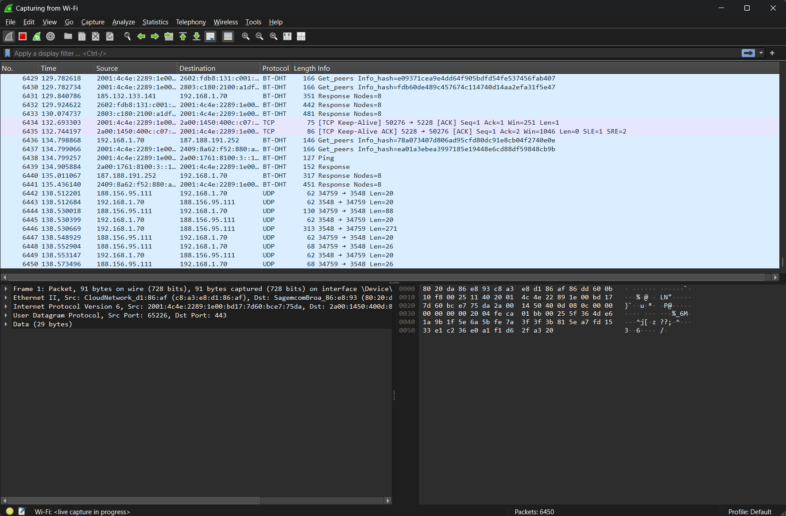

---

### 2. My IP

It is important to know what my IP is to be able to filter the traffic.
To identify my IP I opened cmd and typed `ipconfig`.
Here we can see the traffic going from my IP to other IPs.

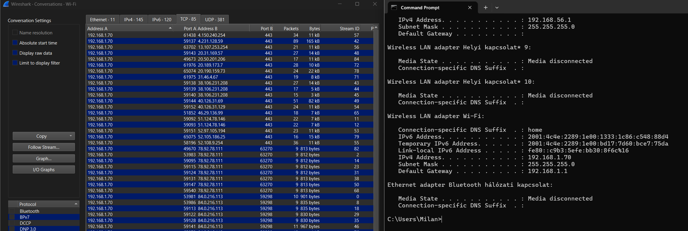

---

### 3. HTTP

Since malicious traffic often comes from a HTTP website, I searched for HTTP traffic.

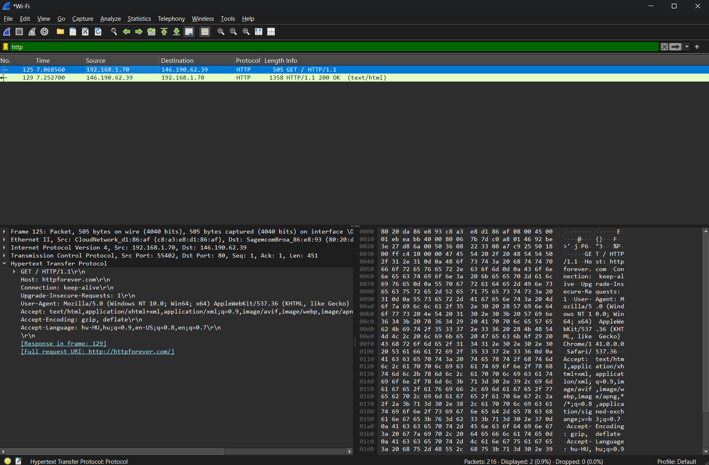

Right-clicking on a row -> Follow -> HTTP Stream shows the window below:

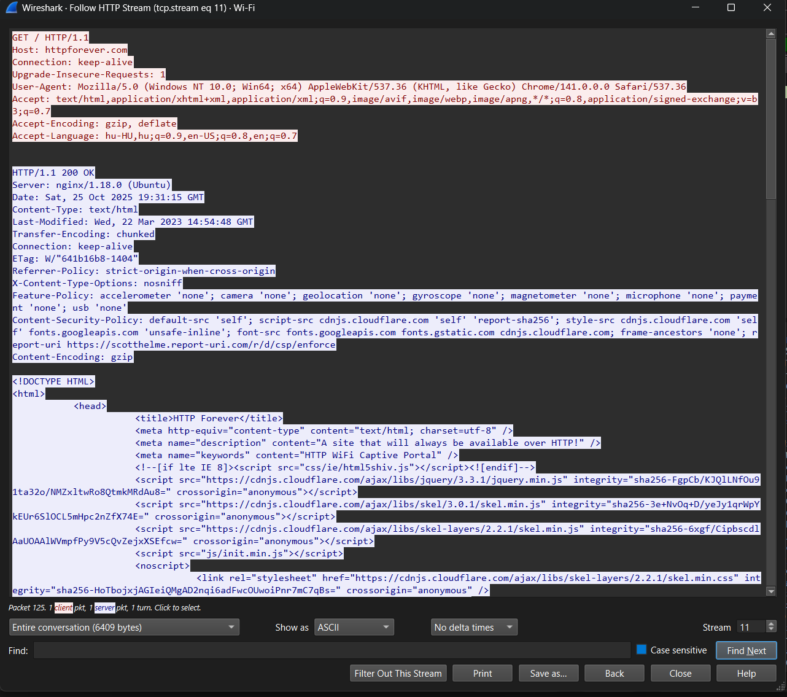

Here we find a lot of information about the website:
- Its domain name
- The machine it runs on
- Last modification
- And the whole HTML file

---

### 4. Create filter buttons for faster results

We can save filters and make clickable buttons for specific searches to be faster.

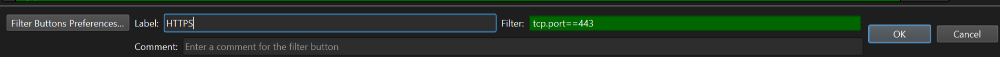

---

### 5. Delta Time

Add Delta Time to see the time between each captured packet

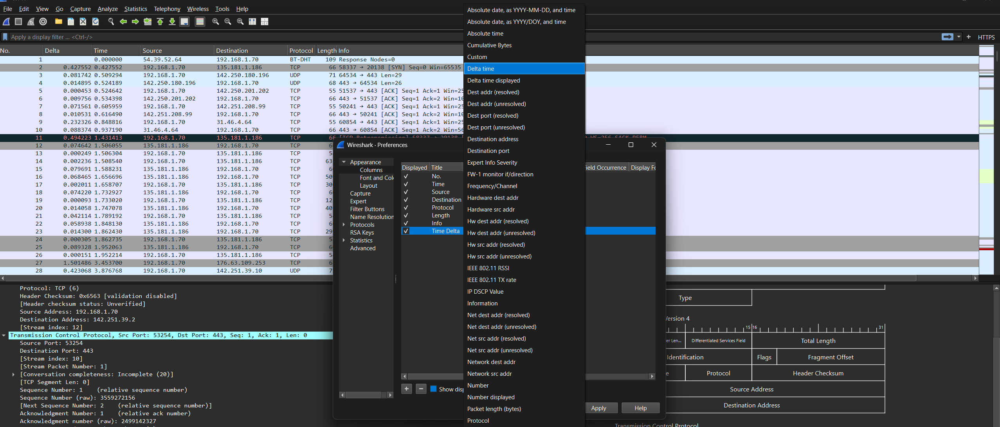

---

### 6. Search for TCP SYN flags

TCP SYN flag shows where the 3-way Hadnshake's first part happens.
This is where connections being opened.
A large number of SYN packets without completion (SYN-ACK, ACK) can indicate a SYN flood attack.

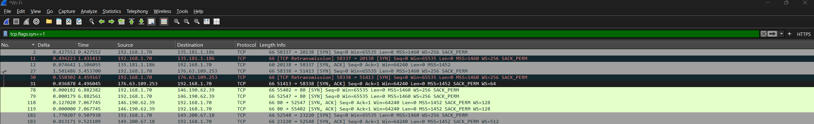

---

### 7. Search for TCP reset flags

This filter is used to search for immediately terminated TCP connections.
Reasons could be:
- closed port
- blocked by firewall
- unexpected crash
...

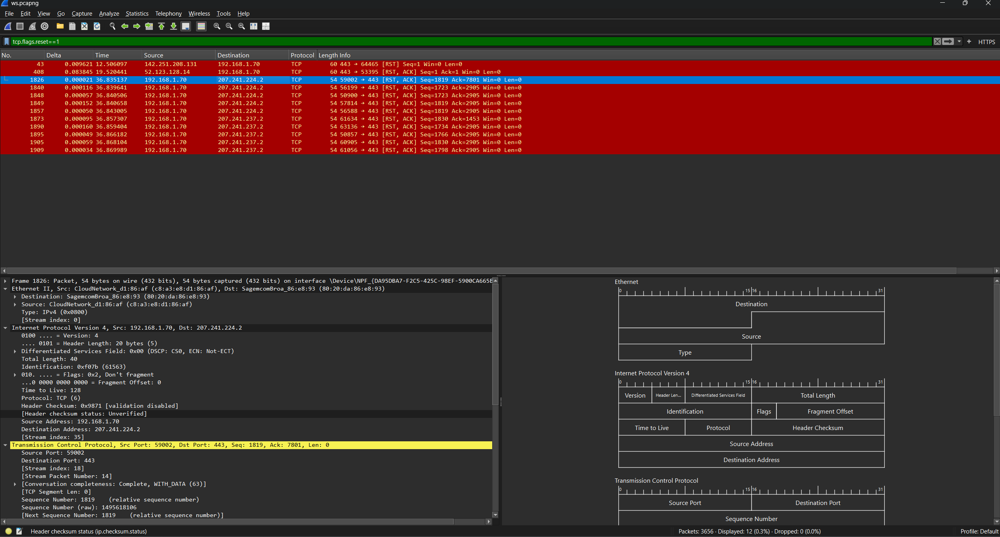

---

---

---

## After learning the basics of Wireshark I started lessions on LetsDefend

---

### 1. Question
What is the destination IP address that received the request with the payload “=${jndi:ldap://”?

# Answer
198.71.247.91

---

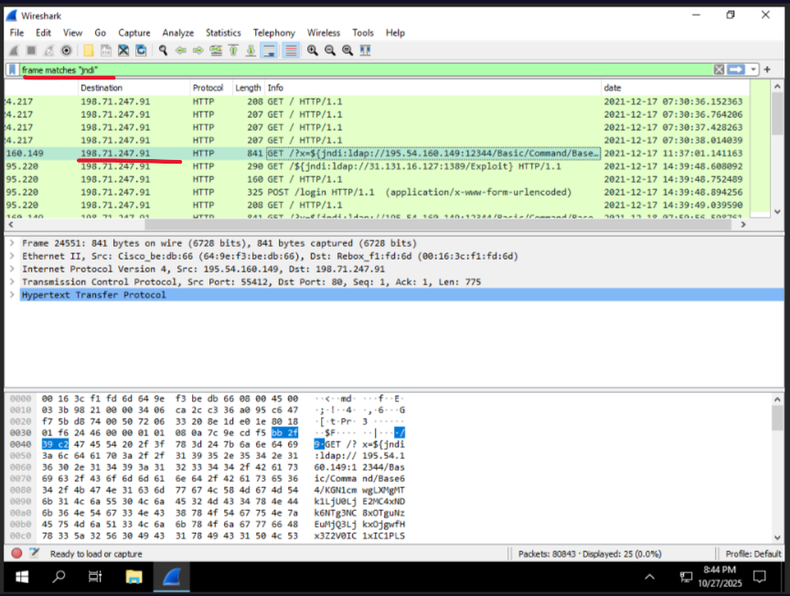

### 2. Question
In what year was the HTTP request sent in the question above?

# Answer
2021

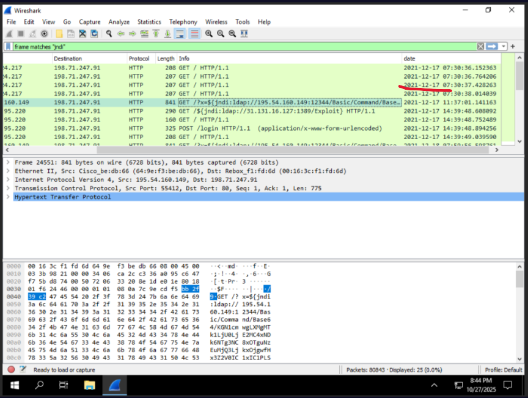

---

How many packets with destination port 80 are among all TCP packets?

# Answer
9410

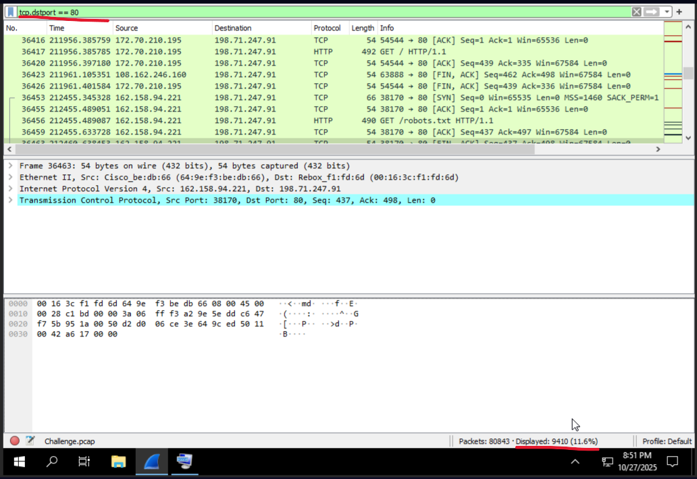

---
### 4. Question
How many packets were exchanged between "198.71.247.91" and "91.189.89.199"?

# Answer
424

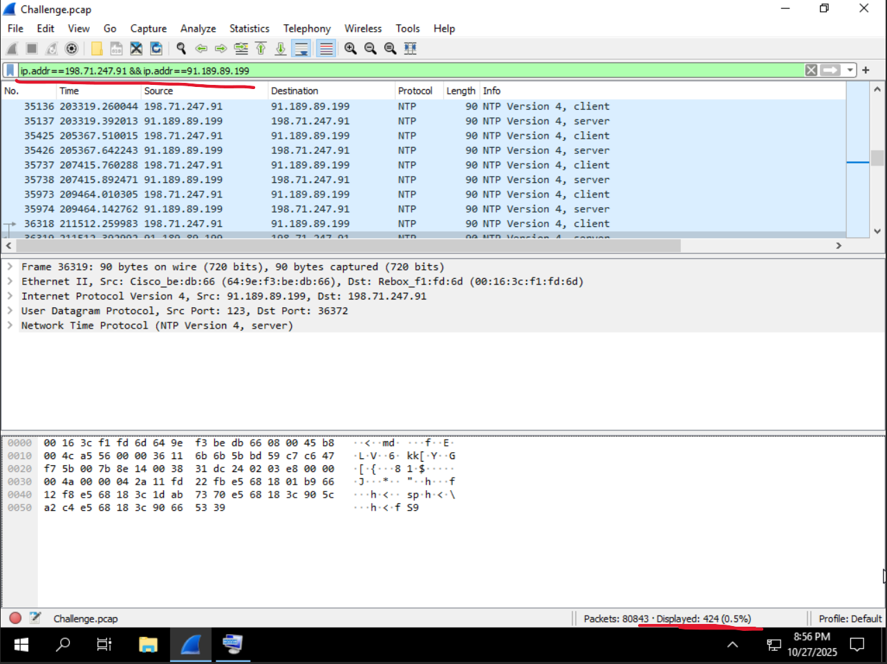

---

### 5. Question
How many IP addresses are there trying to exploit the Log4j vulnerability by connecting to the address “31.131.16.127” according to the log records?

For this question I had to use the Hint: "Search for 31.131.16.127 in HTTP packets"

# Answer:
2

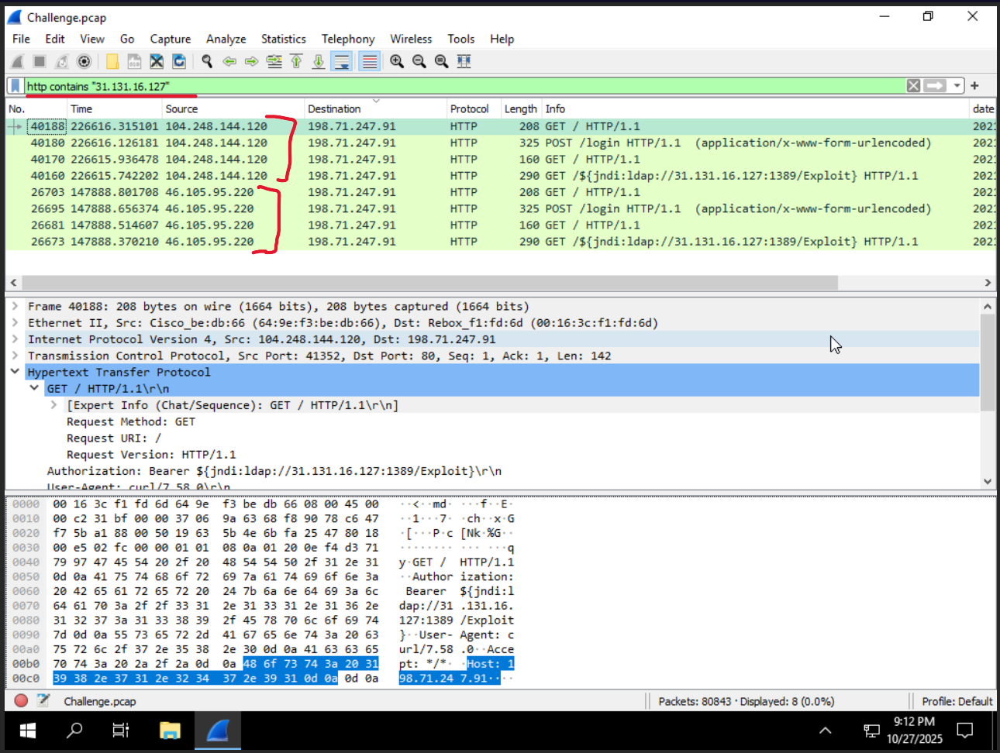

---

## What I learned

By creating this small project I learned how Wireshark works, how to filter traffic, 
what type of data can be captured and got an insight into the work of cybersecurity professionals.